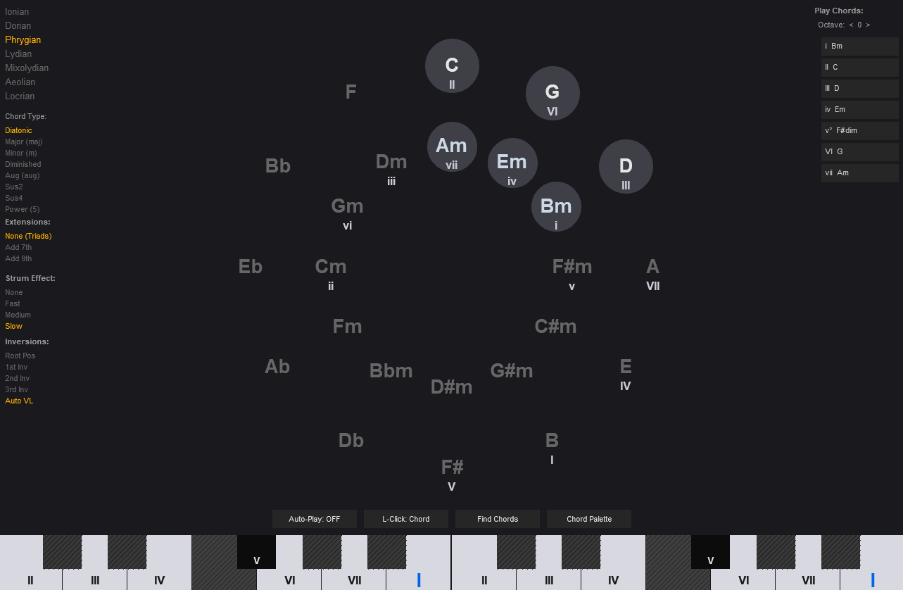
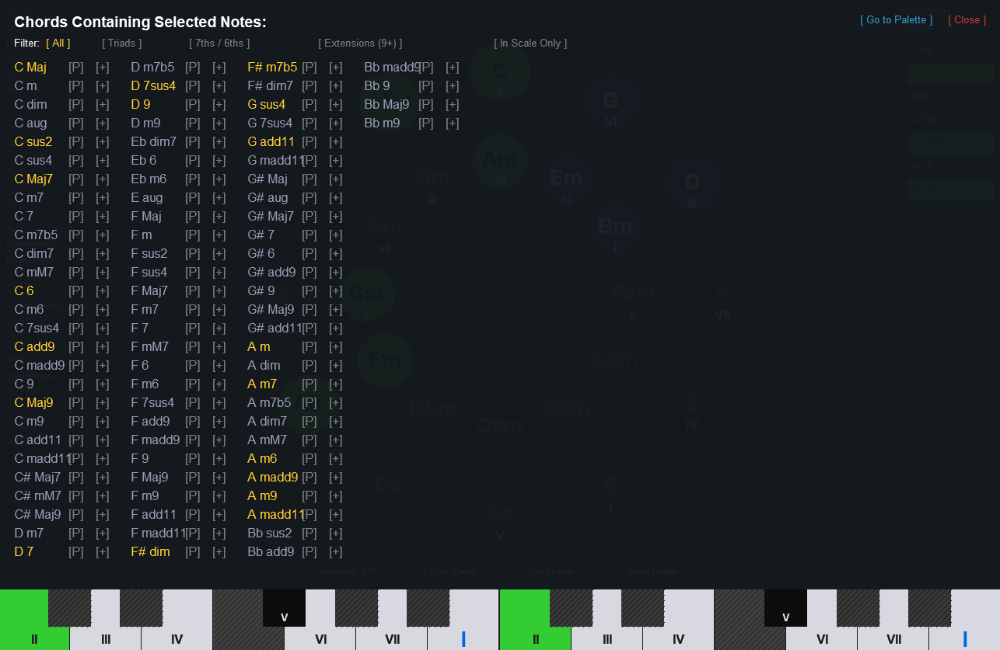
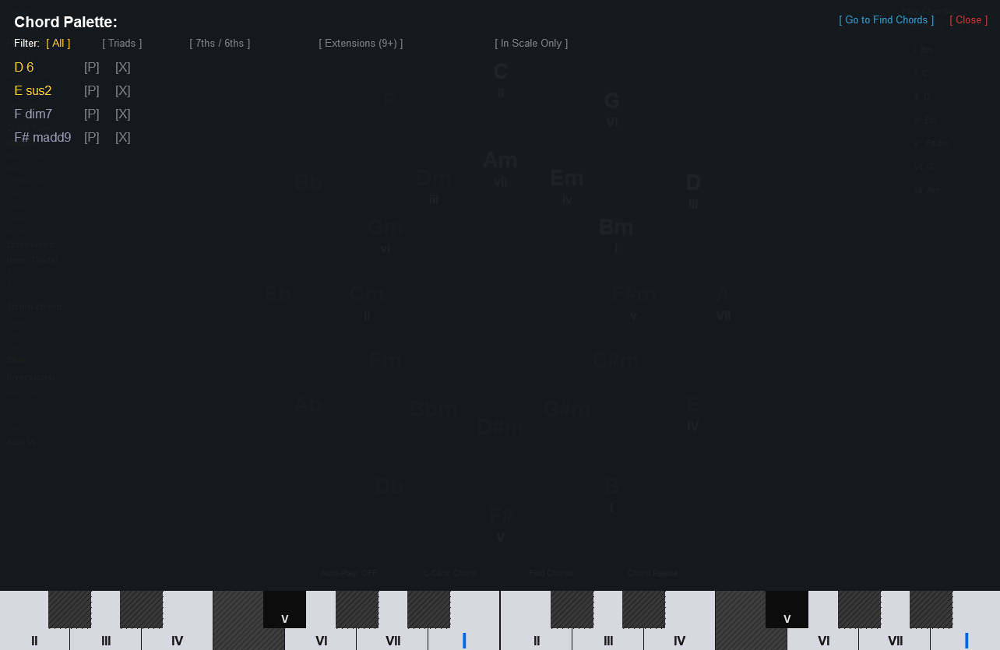

# Circle of Fifths Analyzer & Player for REAPER (JSFX)

## Overview

The **Circle of Fifths Analyzer** is an interactive JSFX plugin for REAPER. It acts as both a visual reference tool for music theory and a playable MIDI chord generator.

### Key Features:
- **Interactive Visualizer:** Displays the Circle of Fifths with dynamic highlighting for diatonic chords based on the selected root and mode (Ionian, Dorian, Phrygian, etc.).
- **Playable Interface:** Left-click on any major or minor circle to instantly play its chord. Right-click to set that node as your new tonal center.
- **Smart Chord Generator:** Play diatonic sequence chords directly from the "Play Chords" side panel.
- **Customizable Voicings:** Modify the active chord types (maj, m, dim, aug, sus2, sus4, power chords), add extensions (7ths, 9ths), and dial in strumming (arpeggiation) effects.
- **Virtual Keyboard:** An interactive on-screen piano keyboard. Left-click to play (toggleable between Note or Chord playback), Right-click to add/remove notes to your selection, and Middle-click to clear.
- **"Find Chords" Engine:** Select notes on the virtual keyboard to instantly discover all chords that contain those notes. Filter results by Triads, 7ths/6ths, Extensions (9+), or restrict them to the current scale (**In Scale Only**).
- **Chord Palette:** A dedicated workspace to save (`[+]`), preview (`[P]`), and organize custom chord progressions.
- **Auto-Play Controls:** Toggle "Auto-Play" ON/OFF to hear chords automatically when selecting them, and switch the keyboard behavior between "L-Click: Note" and "L-Click: Chord".
- **Automation Ready:** Seamlessly integrates with REAPER's envelope automation lanes for modes, chord types, strums, and centers, keeping the plugin UI clean without standard REAPER sliders.

## Advanced Menus & Screenshots

### Find Chords
Search for chords by selecting notes on the keyboard, and filter them by type or matching scale.

### Chord Palette
Store your favorite chords, audition them, and build progressions.

