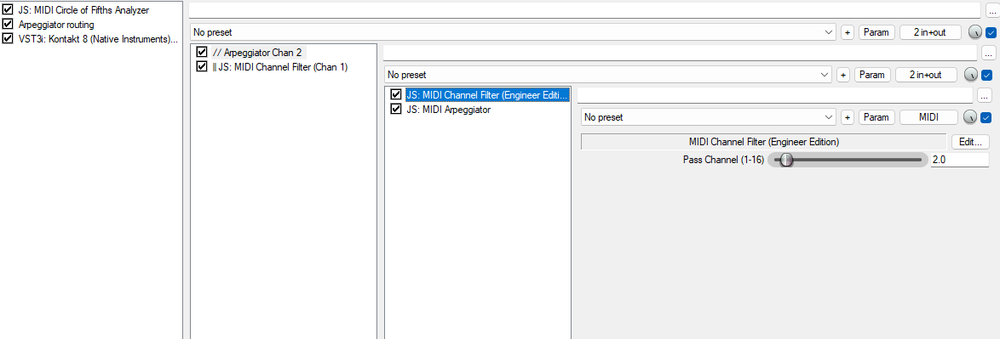
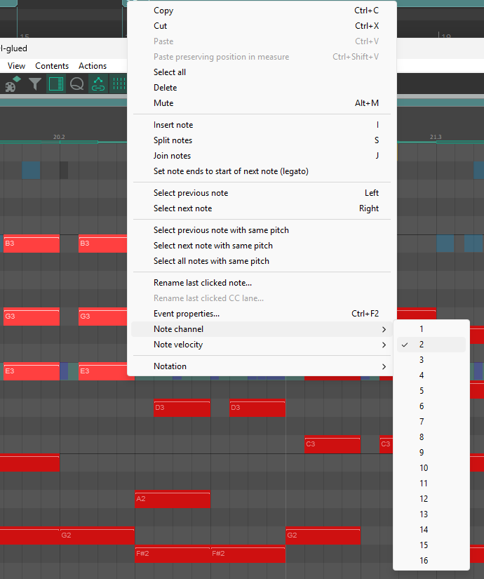

# MIDI Channel Filter

A lightweight JSFX plugin for REAPER that filters incoming MIDI data, allowing only notes from a specific, user-selected MIDI channel to pass through.

## 🎯 Use Case: Selective Arpeggiation

This tool is particularly useful when you have a block of chords and melodies on a single track, but you only want to send **specific notes** to an arpeggiator (or another MIDI effect).

By changing the MIDI channel of certain notes in the REAPER piano roll, you can use this filter to isolate just those notes and pass them along to the sequential effects, leaving the rest of the notes untouched.

## 📸 Screenshots

### 1. Plugin UI

### 2. Setting Notes to a Different Channel

